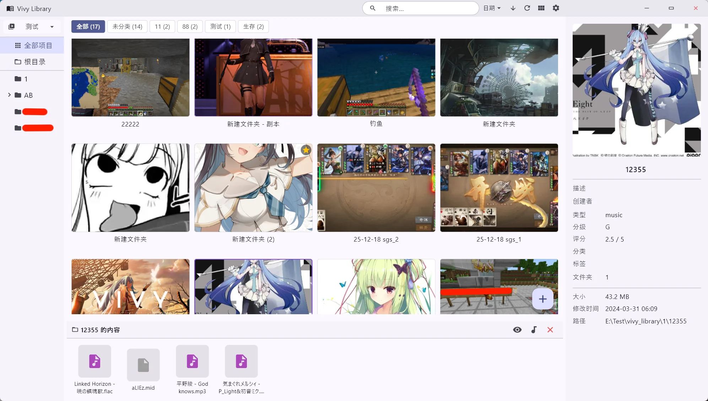
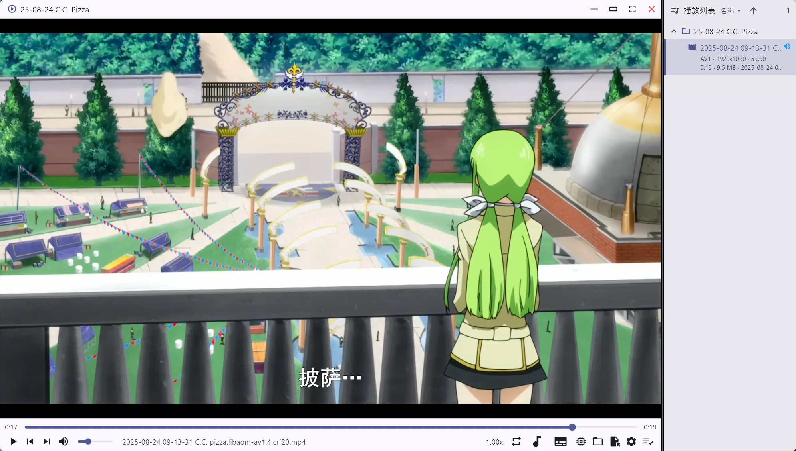
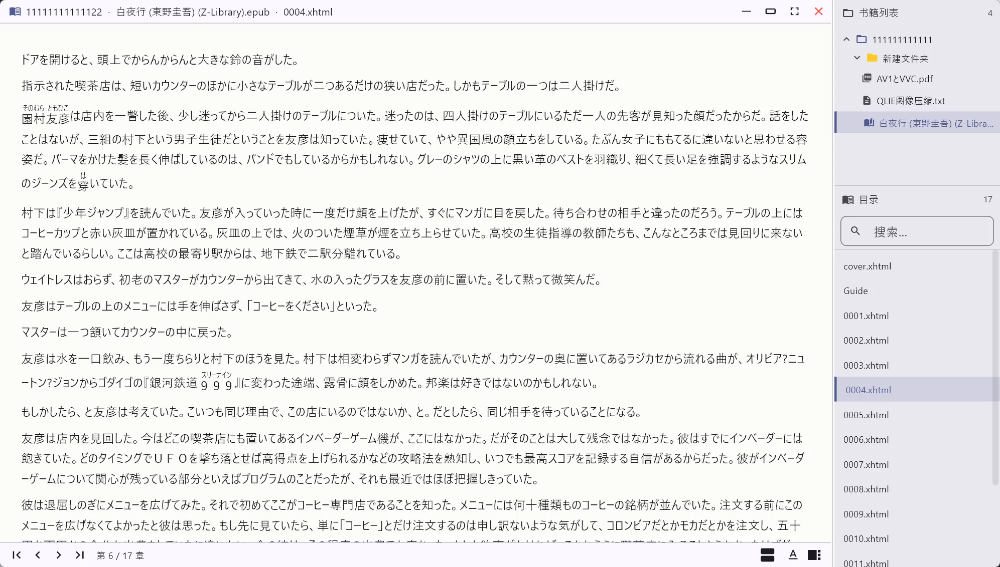
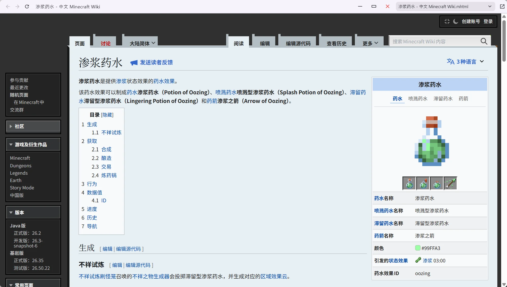
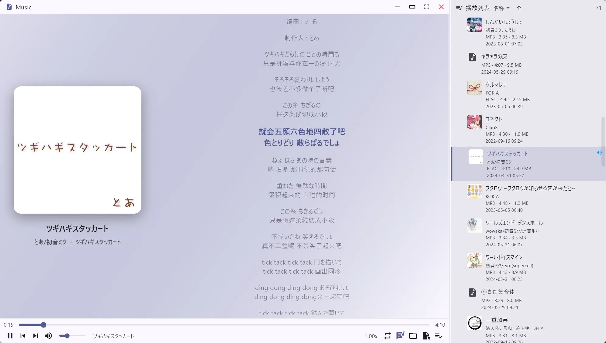
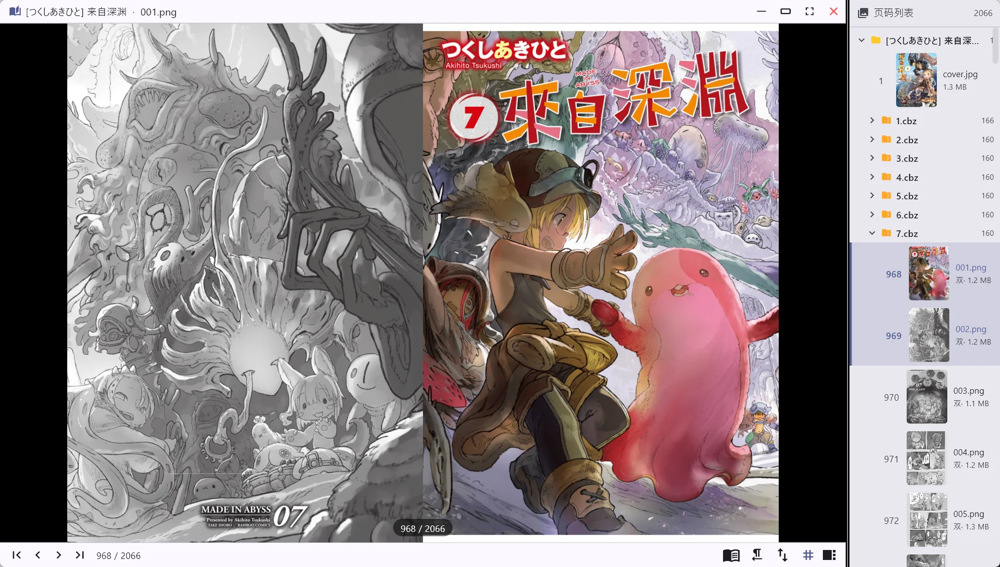

# Vivy Library

一个基于 Flutter 的Windows本地媒体库管理应用。它扫描文件系统目录、读取每个文件夹的 `info.json` 元数据，并以 ~~VS Code 风格的~~三栏界面呈现：卡片网格浏览、丰富的编辑能力、内置播放器/阅读器，以及可扩展的脚本支持。

<p align="center">
  
  
</p>

> **⚠️ 免责声明:** 本项目几乎完全由 AI 生成。代码、文档与设计决策均来自 AI 辅助对话。虽然功能可用，但可能存在怪癖、不地道的写法或值得人工重构之处，请自行斟酌使用。

> **⚠️ 重要说明:**
>
> **功能并不完善。** 本项目仍在快速迭代，许多功能存在粗糙、不完善或表现异常之处，README 中的功能列表描述的是目标能力，实际体验可能存在差距。请先自行试用评估后再决定是否使用。
>
> **建议自行编译。** 发布的 Release 往往严重落后于源码，可能缺少最新的修复与功能。如需最新版本，请使用仓库根目录的 `build.bat` 在 Windows 上自行编译（详见"构建"章节）。

## 截图













## 功能特性

### 资源库扫描与三栏布局

- 递归扫描库根目录，自动构建分类文件夹树（第一层强制为分类，深层按 `info.json` 的 `define` 字段区分 `dir`/`item`/`hide`）
- VS Code 风格三栏布局：左侧分类树、中间卡片网格、右侧详情面板，分隔条均可拖拽调整宽度
- **高性能扫描**：Windows 下使用 Win32 `FindFirstFile` 目录枚举直接获取文件大小与修改时间（零逐文件 `stat`），大量小文件的库刷新提速约 32 倍
- 底部文件面板：浏览项目内文件，支持多选、多文件拖入/拖出、右键菜单（打开方式、重命名、在资源管理器中定位、导出、属性）

### 卡片网格与显示设置

- 5 种显示模式：宽松、紧凑、列表、封面、自适应（最短列瀑布流）
- 分组模式：按标题首字符等分组显示，支持分组排序
- GIF 预览三种播放模式（始终播放/悬停播放/静态）
- 卡片左上角类型徽章（图标 + 颜色），网格显示设置面板统一配置
- 预览图自适应宽高比（砖石布局），平滑高度动画

### 元数据与三级继承

- 编辑标题、描述、创作者、类型、分级、评分、分类、标签、goto 链接
- **三级继承链**：项目自身 → 父文件夹 → 硬编码保底默认值，无 `info.json` 的子项目自动继承父类型（徽章与双击打开行为随之生效）
- 批量编辑：多选项目/文件夹批量操作
- 右侧面板分类/标签可点击直接搜索；编辑支持逗号分隔批量添加标签

### 创建项目

- 浮动按钮或拖入文件/文件夹快速创建项目（创建对话框支持文件选择与拖放导入）
- 预览图裁剪（默认全图、边界受限）、创建进度条
- 互斥锁防止拖入时重复打开对话框；对话框内拖放区悬停高亮

### 内置视频播放器

- 双击视频类项目（`video`/`anime`）以播放列表形式打开，支持从底部面板指定文件开始播放
- 播放列表排序（名称/大小/日期 × 升/降序）并持久化；播放列表宽度与显示状态持久化
- 软/硬件解码切换、音量持久化、毫秒时间显示开关、全屏模式
- 同名外置音频可作为音轨播放；右键（或快捷键）快捷退出
- 顶部标题栏可拖拽窗口，含最小化/最大化/关闭/全屏控件

### 内置音频播放器

- 双击音频类项目（`voice`/`music`）打开，纯 Dart 解析内嵌封面与歌词（无原生依赖）
- 歌词面板：LRC 解析、双语（原文+翻译）同时间戳合并高亮、平滑滚动
- 播放列表条目显示格式·时长·大小与文件修改日期，排序持久化
- 元数据跨页面缓存，重复进入不重探、不泄漏；格式不支持时给出明确提示
- 列表缩略图内存压缩优化

### 漫画/图片阅读器

- 双击图片/漫画类项目（`comic`/`picture`）打开；支持图片文件与 zip/cbz 压缩包
- 页码列表支持文件夹/压缩包树结构；双页模式可跨来源组合
- 缩略图宽度持久化；右键图片区域快捷退出（与视频播放器一致）
- 平滑滚动与缩放

### 内置电子书阅读器

- 双击电子书类项目（`novel`/`book`）打开，支持 txt/epub/pdf/md
- PDF 使用原生 pdfium 内核（pdfrx）渲染
- 目录（TOC）面板宽度持久化；滚动模式懒加载 + 高度估算 + `ListView.builder`
- 阅读设置：阅读模式、字号、行高、字体、主题、页边距、两端对齐，全部持久化
- 平滑滚动；右键快捷退出

### 内置网页浏览器（edgehtml）

- `edgehtml` 类型：Edge 保存的网页（html + `*_files` 资源目录）以本地回环 HTTP 同源服务 + WebView2 完整还原原站排版，解决 `file://` 直开时 CORS 拦 CSS、`.js.下载` 脚本 MIME 不识别的问题
- `.mhtml` 单文件网页直接以 `file://` 打开（WebView2 原生渲染）
- `markdown` 类型：`.md`/`.markdown` 文档由服务端以 GitHub Flavored 转换渲染，配色跟随应用浅色/暗色主题，相对路径图片自动加载
- 同一项目多文件（html/mhtml/md）下拉框切换；后退/前进/刷新；系统浏览器打开
- 标题栏整条可拖拽窗口，含最小化/最大化/关闭按钮；网页内容区长按右键（300ms）快捷退出，短按右键保留浏览器原生菜单

### 类型体系

`video`、`anime`、`voice`、`music`、`comic`、`picture`、`novel`、`book`、`application`、`zip`、`edgehtml`、`markdown`，卡片徽章按类型显示图标与颜色，双击行为按类型路由到对应播放器/阅读器。

### 搜索

- 胶囊形搜索框，跨字段全文搜索（标题、描述、创作者、标签、分类）
- 搜索范围按字段启用/禁用（`SearchScope`），支持任意字段组合

### 主题与外观

- 浅色/深色/跟随系统三种主题模式；精心调校的 VS Code 风格暗色调色板
- 自定义强调色（ColorPicker）；自定义背景图 + 左/中/右分区独立透明度
- 紧凑模式：全局界面缩放滑块（85%~125%，步进 5%）
- 标题栏与窗口按钮悬停效果；整条标题栏可拖拽窗口

### 脚本引擎

- 导入 `.py` 脚本并在选中路径上运行（右键菜单触发）
- 三种运行模式：结果对话框、终端、静默
- 每个脚本可独立启用/禁用，描述从 docstring 解析

### 多语言

简体中文、繁体中文、English、日本語 四种语言，设置页即时切换。

### 数据管理

设置、库根配置与脚本数据可导出/导入为 `.zip` 归档。

### 资源库快照

- 右键左上角资源库按钮打开快照面板：创建快照、选择/重命名/删除/拖拽排序快照、管理所有快照
- 快照把项目的 `info`、预览图（短边 360p JPEG q80，动图取首帧，失败回退原图）与文件清单存入 `%APPDATA%/vivy_library/snapshot/`
- 快照可像资源库一样预览（搜索/筛选/排序/分组/详情均可用），但为只读：不支持内置打开、编辑、多选编辑、脚本与拖放
- 底部常驻琥珀色警告栏提示当前为快照预览，右侧"返回资源库"一键退出

### 构建

- `build.bat`（仓库根目录，Windows）一键构建 release：自动取当天日期注入 `APP_VERSION`（如 `Build260804`），设置页显示"版本 1.0.0 Build260804"
- 版本号运行时从 exe 元数据读取（`package_info_plus`），与 `pubspec.yaml` 自动保持一致；未注入日期时仅显示版本号
- 支持透传额外参数（如 `build.bat --debug`）

### 窗口与交互

- 窗口位置/尺寸/最大化状态持久化，重启恢复；全屏(最大化)记忆
- 启动时窗口越界自动移回可见屏幕
- SmoothScroll 平滑滚动（分类树、列表、歌词、阅读器等）
- 禁用语义树避免 Windows 无障碍桥接刷屏报错

## Info.json 格式

每个库根下的文件夹可包含一个 `info.json` 来描述其内容：

```json
{
    "title": "My Item",
    "description": "A description of this item",
    "creator": "Author Name",
    "type": "video",
    "contentrating": "G",
    "rating": 5,
    "class": ["Collection", "Favorites"],
    "tags": ["tag1", "tag2"],
    "goto": [
        { "uuid": "xxx-xxx-xxx" },
        { "path": "/full/path/to/related/folder" }
    ]
}
```

常用字段说明：

| 字段 | 说明 |
| --- | --- |
| `type` | 项目类型：`video`/`anime`/`voice`/`music`/`comic`/`picture`/`novel`/`book`/`application`/`zip`/`edgehtml`/`markdown` |
| `define` | 文件夹角色：`dir`（分类文件夹）/`item`（项目）/`hide`（隐藏）；缺省为 `item` |
| `preview` | 预览图相对路径，优先于自动查找（自动查找优先 `preview*` 命名，其次任意图片） |
| `goto` | 关联跳转链接，可在详情面板点击跳转到其他项目 |

元数据按 **自身 → 父文件夹 → 硬编码默认** 三级继承，未设置字段自动向上继承。

## 构建

Windows 下一键构建（含日期注入）：

```bat
build.bat              rem release，自动注入 Build 日期
build.bat --debug      rem 调试构建
```

## 目录结构

```
lib/
├── main.dart                   # 应用入口与主题设置
├── models/                     # 数据模型（LibraryItem、CategoryNode 等）
├── providers/                  # 中央状态管理
├── services/                   # 业务逻辑与持久化
├── widgets/                    # UI 组件
└── utils/                      # 工具
```

## 数据存储

用户数据位于 `%APPDATA%/vivy_library/`（首次启动自动从 `shared_preferences` 迁移）：

```
%APPDATA%/vivy_library/
├── settings.json              # 全部应用设置
├── scripts.json               # 脚本元数据
└── scripts/                   # 导入的 Python 脚本
```
